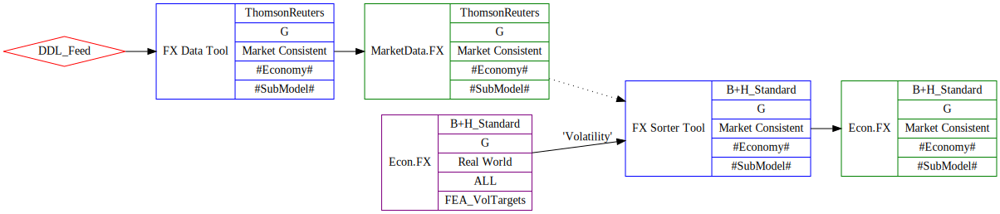
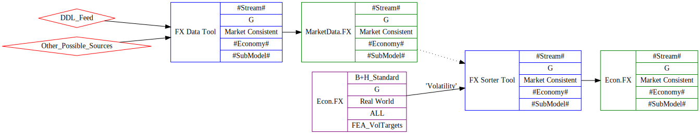
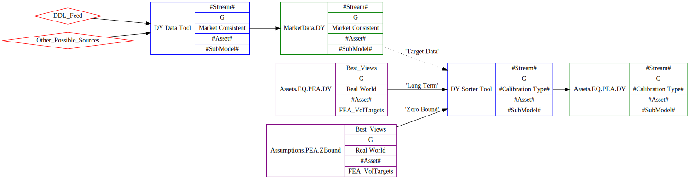
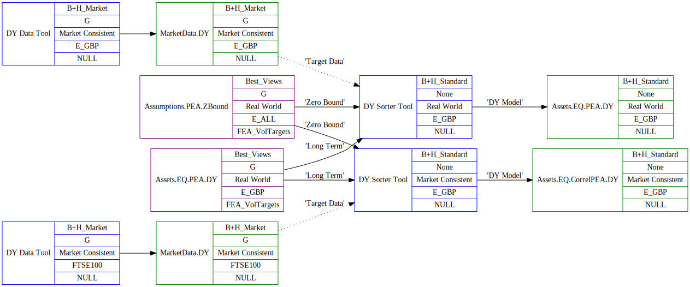

FX and DY Tools specification
=====================

> We will tackle the simpler FX case first, then apply what we have learned to the slightly trickier DY case.

Glossary
--------
FX - Exchange Rates

DY - Dividend Yields

FX
-------------------

To create the process for FX, we will need two tools.

+ A "Data Tool" to process data feeds into a Model.
	+ This will replace the *[MarketData].[usp_DDL_RateData_Insert]* stored procedure.
	+ The model will displace the need for storage of the data point in the "RateData" table.
	+ We can then store data from multiple providers in the future, using models with different stream tags.
+ A "Sorter Tool" to create a calibrated "Econ.FX" Model.
	+ This will replace the *[dbo].[usp_Tool_FXSorter]* stored procedure.
	+ This will produce the same Model calibration as in the previous process.

### TMT Process

We can show how this process will look in the standard case.  

Here, we use the name of the data provider as the stream name in the data process. The final calibrated model has full criteria here (we will need to backfill older results - curve and calibration types were not set in the past). The "Assumptions" here are labelled *'Volatility'* - this is injected to the DB as part of the FEA update, like most other assumptions, and the same model reused for all economies. This assumption includes default parameters for the **Econ.FX** model - these will be used if the optional market data
input is not defined, which will be the case for the *Base Economy* - GBP in our standard calibrations.  

For a more general case, we may need to adapt the FX data tool to take other data sources other than the DDL feed. The sorter tool would then be wired in to this alternative data, and an appropriate stream name chosen.  

Alternatively, we may use a different tool to create the *MarketData.FX* model. This may be an excel tool, if that is the most suitable source for the alternative data.   

> We should try to identify the current client "alternative data case" and ensure this can be performed by the FX kit that we create.  

### Model Parameters

We can show the model parameters we require for each of the models we define.

| Parameter Name              | Source           | 
|--------------------------|-----------------| 
| ExchangeRate            | Market Data GBP per 1 of local currency            | 

Table: MarketData.FX - output model from "Data" tool.

The parameters for the output *Econ.FX* model can be filled out in full from the input models (*Econ.FX*, via the *Volatility* anchor and *MarketData.FX* (same anchored name)) to the tool. 
This is an example of a **Sorter** tool - we can create the output model as a simple transformation of the input data.  

| Parameter Name              | Source           | 
|--------------------------|-----------------| 
| FX_a1            |  *Volatility*.FX_a1          | 
| FX_s1            |  *Volatility*.FX_s1          | 
| FX_r1            |  *MarketData.FX*.ExchangeRate          | 
| FX_mu            |  *MarketData.FX*.ExchangeRate          |			

Table: Econ.FX - output model from "Sorter" tool.

Note that in the *Base Economy* case (i.e. GBP) where we do not define an input model *MarketData.FX*, we use the default parameters for *FX_r1* and *FX_mu* from the *Volatility* input model.

### Resources

The required static data can be added to the environment using the following scripts:

In [\\\\analytics.moodys.net\\ma_eme_dfs\\MA_BH_EDI_USERS\\CS\\2017 Projects\\FX and DY\\Static data updates etc\\](\\\\analytics.moodys.net\\ma_eme_dfs\\MA_BH_EDI_USERS\\CS\\2017 Projects\\FX and DY\\Static data updates etc\\):  

+ [MergeIn_New_Streams.sql](\\\\analytics.moodys.net\\ma_eme_dfs\\MA_BH_EDI_USERS\\CS\\2017 Projects\\FX and DY\\Static data updates etc\\MergeIn_New_Streams.sql)
+ [MergeIn_New_ModelsAndTypes.sql](\\\\analytics.moodys.net\\ma_eme_dfs\\MA_BH_EDI_USERS\\CS\\2017 Projects\\FX and DY\\Static data updates etc\\MergeIn_New_ModelsAndTypes.sql)

In [\\\\analytics.moodys.net\\ma_eme_dfs\\MA_BH_EDI_USERS\\CS\\2017 Projects\\FX and DY\\FX](\\\\analytics.moodys.net\\ma_eme_dfs\\MA_BH_EDI_USERS\\CS\\2017 Projects\\FX and DY\\FX)

+ CAPTURE FX with defaults.sql

This will add a new copy of the *Econ.FX* model that includes default values for mu and r1.  

DY
----------------------

The DY process needs some refactoring first to get our house in order. 
We will jump ahead to the final TMT flow of data through the processing tools we will create, then work backward to describe how we arrived at this solution. 

### TMT Flow

   

First we need to process the raw data feeds into a "MarketData.DY" model that we can use in TMT. 
The market data model will be stored against an *Equity Asset*. This will be "our" name for the index that the DY we download represents. 
Note that we will need to add a good few new assets to our database - these are commonly not the same as the assets that we model in the ESG.  

We will then use a "DY Sorter Tool" (*name TBD*) that we will use to combine the inital target data with our assumptions to create the output dividend yield model. 
We split our assumptions into the long term Volatility part 
- an *Assets.PEA.DY* model with the *FEA_DYTargets" submodel for the long term volatility part,
 and a separate *Assumptions.PEA.ZBound* model for the global setting for the zero bound part of the model.  

For DY, we will create separate models for the "Market Consistent" and "Real World" calibration types for the same Stream and Asset.
These may have different TMT configurations, and will always have a different model output assigned to the *'DY Model'* output.  

We can show this in the use case for the "E_GBP" asset under the RW and MC streams in the specific TMT diagram below.  

Here we are gathering two separate 'MarketData.DY' models, and assigning these to the appropriate *Asset*. 
We want to create a RW and an MC version of the output DY model, which are "Assets.EQ.PEA.DY" and "Assets.EQ.CorrelPEA.DY" respectively. 
So, we will set up 2 separate runs of the 'DY Sorter' tool to run each case for the E_GBP asset. 
The 'Zero Bound' and 'Long Term' input models are the same in both cases, but the 'Target Data' that we use differs. 
Note that the index for the 'Target Data' need not match the index used in the DY calibration - we are assigning the use of a DY for one index as the target value for another.  

We can now go into more detail on the elements of this process.  

#### New Equity Assets

We collect DY information on a large range of equity indices. 
This coverage is beyond what we currently model in the ESG - we could think of these assets as being more specific than the generic assets that we model. 
As a result, we will need to create additional assets in our databases, to represent the new indices that we collect DY data on.  

As I have worked backward from the DY model, I have only considered the cases where we use the DY value in a calibration, so this list may grow if we want to cover all DY values collected.  

In [\\\\analytics.moodys.net\\ma_eme_dfs\\MA_BH_EDI_USERS\\CS\\2017 Projects\\FX and DY\\DY\\New assets\\](\\\\analytics.moodys.net\\ma_eme_dfs\\MA_BH_EDI_USERS\\CS\\2017 Projects\\FX and DY\\DY\\New assets\\)

+ [MergeIn_New_Assets.sql](\\\\analytics.moodys.net\\ma_eme_dfs\\MA_BH_EDI_USERS\\CS\\2017 Projects\\FX and DY\\DY\\New assets\\MergeIn_New_Assets.sql)
	+ Will add specified all new assets to the CalBy database
+ [MergeIn_New_Ghost_AllMissingEquities.sql](\\\\analytics.moodys.net\\ma_eme_dfs\\MA_BH_EDI_USERS\\CS\\2017 Projects\\FX and DY\\DY\\New assets\\MergeIn_New_Assets.sql)
	+ Will add all equity assets in the CalBy database to CaSPr - effectively a "catch up" script for CaSPr

#### DY Data Model

A new model for the output of the DY Market Data Tool can be added using:

In [\\\\analytics.moodys.net\\ma_eme_dfs\\MA_BH_EDI_USERS\\CS\\2017 Projects\\FX and DY\\Static data updates etc\\](\\\\analytics.moodys.net\\ma_eme_dfs\\MA_BH_EDI_USERS\\CS\\2017 Projects\\FX and DY\\Static data updates etc\\):  
+ [MergeIn_New_Streams.sql](\\\\analytics.moodys.net\\ma_eme_dfs\\MA_BH_EDI_USERS\\CS\\2017 Projects\\FX and DY\\Static data updates etc\\MergeIn_New_Streams.sql)
+ [MergeIn_New_ModelsAndTypes.sql](\\\\analytics.moodys.net\\ma_eme_dfs\\MA_BH_EDI_USERS\\CS\\2017 Projects\\FX and DY\\Static data updates etc\\MergeIn_New_ModelsAndTypes.sql)

These are the same scripts as for the FX work above.  

The new model created is called *'MarketData.DY'*.

#### Zero Bound Assumptions

I have separated the assumptions so that the "Static" part can be written to the DB just once (for the earliest date avaliable as a persitent model). 

The new model will be called *'Assumptions.PEA.DY.Zbound'*, and will contain the two parameters associated with the lower bound. 
In practice, we will use this for every DY model we will create.  
I have also created a *'Assumptions.CEA.DY.Zbound'* model, for use with child equity assets. We will not be using the DY sorter for child assets as yet, so this is just future-proofing for now.  

Scripts can be found in [\\\\analytics.moodys.net\\ma_eme_dfs\\MA_BH_EDI_USERS\\CS\\2017 Projects\\FX and DY\\DY\\ZeroBound\\](\\\\analytics.moodys.net\\ma_eme_dfs\\MA_BH_EDI_USERS\\CS\\2017 Projects\\FX and DY\\DY\\ZeroBound\\)  

+ MergeIn_New_ModelsAndTypes.sql
	+ To add both model names.
+ LastExport_DY_Zbound_Assumption.sql
	+ A capture of the export of the static models.

#### Long-term Assumptions

We want to store our long-term assumptions, provided by the FEA team, to the DB as a model. 
We will use the same model name as the RW DY model - *'Assets.EQ.PEA.DY'* , and will add the targets with the existing *'FEA_DYTargets'* submodel.  

These will be pushed against "generic" equity asset names - i.e. the "E_XXX" assets - with a few median and default cases.    

This will be uploaded on an annual basis from the *Assumptions_IE_DividendYield.xlsm* tool. 
A capture of the latest values for these can be found in 
[\\\\analytics.moodys.net\\ma_eme_dfs\\MA_BH_EDI_USERS\\CS\\2017 Projects\\FX and DY\\DY\\LastExport_DividendYield_FEA_30092016.sql](\\\\analytics.moodys.net\\ma_eme_dfs\\MA_BH_EDI_USERS\\CS\\2017 Projects\\FX and DY\\DY\\LastExport_DividendYield_FEA_30092016.sql) 

#### DY Ouput Model - MC and RW versions

The '*DY Sorter Tool*' will produce a differently named model dependent on whether or not we are producing a Real World Market or Consistent calibration ("Assets.EQ.PEA.DY" and "Assets.EQ.CorrelPEA.DY" respectively).  

This should be controlled by how we set up the anchored 'DY Model' output.  

In order to simplify this, we can standardise the parameters in the two models so that these are identical. We need to drop the "RW_" and "MC_" prefix in the parameters we store, and the models will be identical, as they are in the ESG. 
The model name will control how these are mapped when we generate a BHC from this model.  

The required update to the mapping can be found in:
[\\\\analytics.moodys.net\\ma_eme_dfs\\MA_BH_EDI_USERS\\CS\\2017 Projects\\FX and DY\\DY\\Parameter Update\\DY - AddParam Script.sql](\\\\analytics.moodys.net\\ma_eme_dfs\\MA_BH_EDI_USERS\\CS\\2017 Projects\\FX and DY\\DY\\Parameter Update\\DY - AddParam Script.sql) 

> Note that we are adding additional mapped parameters, so we do not *need* to backfill past results. We may choose to later, to make historical queries easier.  

#### DY Data Tool

We need a TMT "DY Data Tool" to take the downloaded latest DY index value, and push this as a *'MarketData.DY'* Model.  

We will need to map from the "ticker" that we use to download and store the rate data to the "asset" that this represents. We will also need to store the name of the data provider for that ticker.  

We will need to use the **Settings** of the "DY Data Tool" to store the *Ticker* and *Data Source* information against each Asset. 
This is less flexible than a pure TMT solution, but as we will only run these for one stream (*'B+H_Market'*), settings will be OK here.  

The table of *Index*, *Ticker* and *Source* values that we need can be found in the spreadsheet:  

[\\\\analytics.moodys.net\\ma_eme_dfs\\MA_BH_EDI_USERS\\CS\\2017 Projects\\FX and DY\\DY\\DY - Tickers to Index list.xlsm](\\\\analytics.moodys.net\\ma_eme_dfs\\MA_BH_EDI_USERS\\CS\\2017 Projects\\FX and DY\\DY\\DY - Tickers to Index list.xlsm)  

The sheet "Summary" contains the table.  

#### DY Sorter Tool

The "DY Sorter Tool" will take up to 3 input models.  

+ **'Target Data'**
	+ A Model of the type *'MarketData.DY'* containing the short-term dividend yield target value.
	+ May be optional - in this case, the **'Long Term'** model must contain the short-term target value.
+ **'Zero Bound'**
	+ A model of the type *'Assumptions.PEA.DY.Zbound'*, containing the chosen zero bound levels of the DY model.
+ **'Long Term'**
	+ A Model of the type *'Assets.EQ.PEA.DY'*, containing the long term, or distribution parameters for the DY model.
	+ May contain an unconditional value for the short-term dividend yield, which will be used in the output if the optional **'Target Data'** input is not defined.  

In practice, all **property** assets will be defined without a **'Target Data'** input, and will use the value from the **'Long Term'** model input using the asset *'P_ALL'*. 
The **'Zero Bound'** model will be the same for all cases.  

There is one output model:

+ **'DY Model'**
	+ A Model of the type *'Assets.EQ.PEA.DY'* or *'Assets.EQ.CorrelPEA.DY'*.
	+ The model parameters are identical in both models.

The table of Output Asset and Calibration Type usage to  values to the input Target and Long-term Assets can be found in the spreadsheet (The sheet "Summary" contains the table):  

[\\\\analytics.moodys.net\\ma_eme_dfs\\MA_BH_EDI_USERS\\CS\\2017 Projects\\FX and DY\\DY\\DY - Tickers to Index list.xlsm](\\\\analytics.moodys.net\\ma_eme_dfs\\MA_BH_EDI_USERS\\CS\\2017 Projects\\FX and DY\\DY\\DY - Tickers to Index list.xlsm)  

##### Tool Settings

The DY model requires a "Display Name" output parameter for use in documentation. This changes dependent on how the model is used, so can't be linked back to any input model. 
The Settings table is then the correct place for this - we will . The values for each index we need is included in the spreadsheet table.  

### DY Model Parameters

We can now look at the parameters of the output model, and see how these relate to the input models. This should also define all that we need for the new models that we create for market data.  

All that we need to do within the logic of the tool is to take our input parameters and settings, and map these to the parameters in the output model. We can consider this type of tool to be a *Sorter Tool*.  

Note that we are using our refactored version of the parameters, so there is no "BE_" or "MC_" prefix on the parameters.  

  

This table can be found in the spreadsheet described above.  

> Note that I have dropped the "Asset Type" parameter, as this has nothing to do with DY. It is a property of the Asset. 
> I will need to check that we do not need this in documentation - if we do, it will be added somewhere else.  

